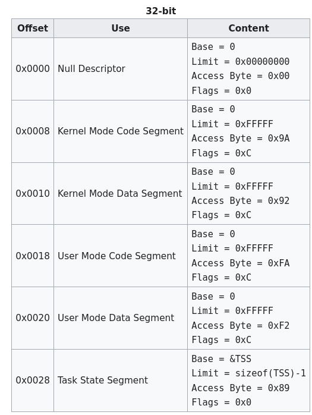

## **About the project**

- **Kernel from Scratch (KFS)** is a 10-part project developed by the 42 Network, focused on building a computer kernel from scratch, without any existing software, API, or such. The architecture `i386 (x86)` is mandatory.
- **Kfs-2** aims to implement a **Global Descriptor Table (GDT)**.  The **GDT** must be declared to the `BIOS` and be set at address `0x00000800`.

## Getting started

1. **Clone the repository:**

```bash
git clone git@github.com:LDuheron/kfs-2.git
```

1. **Build the docker image :**

The Dockerfile is building our own cross-compiler using the multistage technique to optimize the compilation process. The process can take around 20 minutes to build the Docker 
image. To build the Docker image, run:

```
make
```

# Global descriptor table

The **Global Descriptor Table (GDT)** is a data structure used by Intel processors to define characteristics of various memory areas, known as **segments**, by storing descriptors that describe those segments.

These descriptors contain crucial information, such as the **base address** (where the segment starts), the **limit** (the size of the segment), and **access rights** (permissions like read, write, or execute). This information helps the CPU manage and protect memory by enforcing access control on different areas.

In our implementation, the structure of the segment descriptor is defined in the **gdt.h** file from bottom to top, as shown below:

```c
struct  gdt_segment_descriptor_struct {
	short   limit;
	short   baseLow;
	char    baseMid;
	char    accessByte;
	char    flags;
	char    baseHigh;
};__attribute__((packed));
```

**The GDT is specific to x86 processors.**

While **64-bit processors** typically rely on **paging** for memory management, **i386 (x86)** processors combine both **paging and GDT** to handle memory. The GDT defines the segments, whereas paging enables more advanced memory management techniques like virtual memory. This hybrid approach allows the **i386 architecture** to efficiently manage and protect memory while providing flexibility in how memory is accessed and organized. The size of the GDT can vary depending on the number of segments defined and the specific design of the operating system.


# Setting the GDT’s entries

The global descriptor table entries are defined in the `gdt.c` file. The subject requires implementing 6 entries : 

- Kernel Code segment
- Kernel Data segment
- Kernel stack segment
- User code segment
- User data segment
- User stack segment

However, we define 7 entries as the inclusion of a null descriptor is mandated by the standard:

```c
void initGdt() {
	gdt_ptr.limit = (sizeof(struct gdt_segment_descriptor_struct) * 7) - 1;
	gdt_ptr.base = (unsigned int) &gdt_entries;

	setGdtEntries(0, 0, 0, 0, 0);
	setGdtEntries(1, 0, LIMIT, KERNEL_MODE | CODE_MODE, FLAG);
	setGdtEntries(2, 0, LIMIT, KERNEL_MODE | DATA_MODE, FLAG);
	setGdtEntries(3, 0, LIMIT, KERNEL_MODE | DATA_MODE, FLAG); //Kernel Mode Stack Segment
    setGdtEntries(4, 0, LIMIT, USER_MODE | CODE_MODE, FLAG);
    setGdtEntries(5, 0, LIMIT, USER_MODE | DATA_MODE, FLAG);
    setGdtEntries(6, 0, LIMIT, USER_MODE | DATA_MODE, FLAG); // User Mode Stack Segment
    writeGdtToRegisters(&gdt_ptr);
   }
```

The reason for separating segments in the GDT is **protection** and **security**. In a modern system, **kernel mode** (privileged mode) has **full access** to all resources and can directly manipulate hardware, memory, and system data. On the other hand, **user mode** (non-privileged mode) has restricted access to prevent malicious or faulty applications from interfering with the kernel or accessing sensitive system data. By separating these segments, the GDT ensures that **user code** cannot accidentally or intentionally modify **kernel memory** or escalate its privileges, maintaining system stability and security.

We fill the GDT entries following the OsDev guidelines :



### The Global Descriptor Table Register :   `GDTR`

The **GDTR** stores the **base address** and the **size** of the **Global Descriptor Table (GDT)**. In this case, its address is fixed at `0x00000800`, as specified by the project. The GDTR helps the CPU locate the GDT and determines its size, ensuring that it doesn't access memory beyond the GDT's bounds.

The GDTR is a **48-bit register**, consisting of two parts:

1. **Base**: A **32-bit** value representing the address of the GDT in memory.
2. **Limit**: A **16-bit** value representing the size of the GDT in **bytes minus 1**. For example, if the GDT contains 10 descriptors, each 8 bytes, the GDT's size is 80 bytes, but the value stored in the GDTR's limit would be **79** (80 - 1).

The GDTR is declared in the `boot.s` file. The `lgdt` instruction loads the GDTR to inform the CPU of the GDT’s location and size:

```nasm
	/* Loads the GDTR so the CPU can locate the GDT*/
	lgdt [gdtr]
```

The following code defines the GDTR, specifying its size and base address.

```nasm
/* Defining the Global Descriptor Table Register */
gdtr:
	/*Size of the GDT*/
	.word 0x55
	/*Base address of the GDT*/
	.quad 0x00000800

```

## Resources

- OsDev Global descriptor table : https://wiki.osdev.org/Global_Descriptor_Table
- OsDEV GDT tutorial : https://wiki.osdev.org/GDT_Tutorial
- OsDev Paging : https://wiki.osdev.org/Paging
- OsDev Segmentation : https://wiki.osdev.org/Segmentation
- OsDev Segment selectors : https://wiki.osdev.org/Segment_Selector 
- OliveStem - x86 Operating systems - Implementing a GDT : https://youtu.be/jwulDRMQ53I?feature=shared
